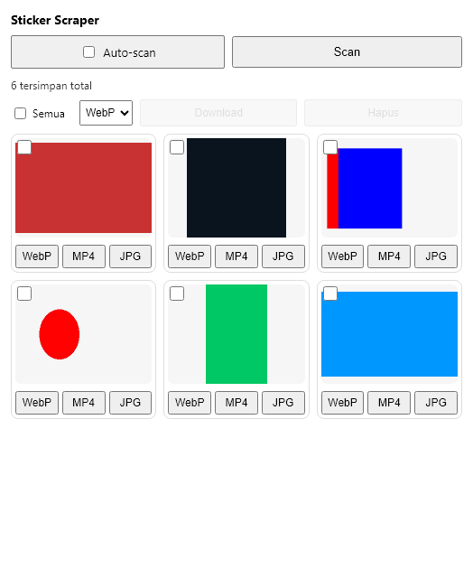

# TikTok Sticker Scraper

Extension Chrome untuk scrape stiker TikTok (DM/messages) lalu download sebagai **square 1:1** — tanpa crop, diganjal pixel.

## Fitur

- **Scan stiker terlihat** — ambil `` stiker + `<video>` animasi yang tampil di viewport, otomatis ketampung di History.
- **Auto-scan** — nyala terus di tab, History nambah sendiri saat scroll.
- **History, terbaru di atas** — tersimpan persisten (deduplikat per URL).
- **Download 1:1 (padding, tanpa crop)** — nama file `sticker-1`, `sticker-2`, … sesuai urutan tampil, semua dikerjakan di browser:
  - **WebP** — WebP animasi di-patch lossless (animasi utuh), statis via canvas.
  - **MP4** — MP4 asli langsung; WebP/GIF di-convert jadi video ±3 detik.
  - **JPG** — frame pertama, background putih (termasuk capture frame dari MP4).
- **Select banyak** — centang kartu atau klik stikernya (yang dipilih beda warna), lalu Download/Hapus sekaligus dengan pilihan format WebP/MP4/JPG.

## Cara pasang

1. Buka `chrome://extensions`, nyalakan **Developer mode**.
2. **Load unpacked** → pilih folder ini.
3. Buka `tiktok.com/messages`, klik ikon extension → **Scan** (atau nyalakan Auto-scan).

## Struktur file

| File | Keterangan |
|---|---|
| `manifest.json` | Manifest extension (MV3) |
| `popup.html` / `popup.js` | UI + logika popup (scrape, square-pad 1:1, select, download) |
| `content.js` | Scraper di halaman TikTok (visible scan + auto-scan observer) |
| `Public/popup.png` | Screenshot popup |
